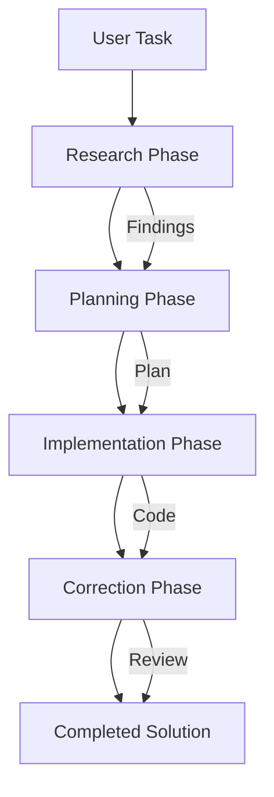

# Multi-Phase Orchestrator

A sophisticated workflow orchestrator that decomposes complex tasks into specialized phases, each handled by an expert sub-agent with dedicated instructions.

## Purpose

This system automates complex development tasks by breaking them into:
1. **Research** - Deep analysis and approach validation (Opus 4.5)
2. **Planning** - Detailed implementation planning (Opus 4.5)
3. **Implementation** - Code execution following standards (Sonnet 4.5)
4. **Correction** - Review and quality assurance (Opus 4.5)

## Project Structure

```
.claude/
├── settings.json          # Permissions and configuration
├── CLAUDE.md             # This file - project context
└── commands/
    └── orchestrate.md    # Custom /orchestrate command

instructions/
├── research-phase.instructions.md       # Research agent guidelines
├── implementation-phase.instructions.md # Implementation agent guidelines
└── coding-standards.instructions.md     # Code quality standards

src/
└── orchestrator.ts       # Main TypeScript orchestrator

outputs/                  # Generated phase outputs
├── research_*.json
├── plan_*.json
├── implement_*.json
├── correct_*.json
└── workflow_summary_*.json
```

## Key Features

### Phase-Specific Agents
Each phase uses an agent optimized for its task:
- **Research (Opus)**: Thorough analysis, assumption verification, multi-approach exploration
- **Planning (Opus)**: Strategic thinking, detailed implementation plans
- **Implementation (Sonnet)**: Fast code execution, follows standards precisely
- **Correction (Opus)**: Critical review, identifies gaps and issues

### Context Propagation
Later phases receive all previous phase results, ensuring continuity and informed decision-making.

### Instruction-Driven
Each phase loads detailed markdown instructions that guide agent behavior, making the system customizable and maintainable.

### Output Tracking
Every phase saves timestamped JSON outputs for:
- Progress tracking
- Debugging
- Learning from agent decisions
- Audit trails

## Usage

### Option 1: Direct TypeScript Execution
```bash
npm install
npm start "Create a REST API with authentication and rate limiting"
```

### Option 2: Claude Code Integration
```
/orchestrate Create a REST API with authentication and rate limiting
```

### Option 3: Programmatic Usage
```typescript
import { MultiPhaseOrchestrator } from './src/orchestrator';

const orchestrator = new MultiPhaseOrchestrator(
  './instructions',
  './outputs'
);

await orchestrator.orchestrate("Your task description");
```

## Workflow



## Instruction Files

### research-phase.instructions.md
- Evidence-based documentation only
- Question user assumptions
- Research minimum 2 approaches
- Document findings in ./research/
- Never modify source code

### implementation-phase.instructions.md
- Read complete plan before starting
- Follow project conventions first
- Technology-specific guidelines (React, C#, etc.)
- Comprehensive testing requirements
- Mark tasks complete as finished

### coding-standards.instructions.md
- General principles (consistency, simplicity)
- C# / .NET standards
- TypeScript / React standards
- Project structure recognition

## Customization

To adapt for your specific needs:

1. **Modify instruction files** in `instructions/` directory
2. **Adjust agent configs** in `src/orchestrator.ts`
3. **Add new phases** by extending the orchestrator
4. **Change models** per phase based on requirements

## Best Practices

1. **Clear Task Descriptions**: Provide detailed context in the initial task prompt
2. **Review Outputs**: Check `outputs/` to understand agent reasoning
3. **Iterate on Instructions**: Refine instruction files based on results
4. **Standard Naming**: Keep phase names consistent for tracking
5. **Output Management**: Periodically clean old outputs to save space

## Troubleshooting

### Phase not producing expected results
- Review instruction file for that phase
- Check `outputs/` for the phase's JSON output
- Verify agent has access to necessary tools

### Long execution times
- Consider using Sonnet for more phases
- Simplify instruction files
- Break down complex tasks into smaller orchestrations

### Missing context between phases
- Ensure previous phase results are being passed
- Check console output for context preview
- Review workflow_summary JSON for full chain

## Development

### Building
```bash
npm run build
```

### Development Mode (with auto-reload)
```bash
npm run dev
```

### Running Tests
```bash
npm test
```

## Integration Points

- **Claude Code CLI**: Use `/orchestrate` command
- **VS Code**: Execute via integrated terminal
- **CI/CD**: Automate complex build/deploy workflows
- **Custom Scripts**: Import and use programmatically

## Future Enhancements

- [ ] Parallel phase execution for independent tasks
- [ ] Phase retry logic with exponential backoff
- [ ] Interactive approval between phases
- [ ] Phase result caching for similar tasks
- [ ] Visual progress dashboard
- [ ] Integration with project management tools

---

**Version**: 1.0.0
**Status**: Production Ready
**Last Updated**: 2026-01-08
